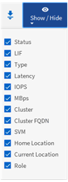

= Personalizar columnas
:allow-uri-read: 
:icons: font
:imagesdir: ../media/

[role="lead"]
Utilice *Mostrar/Ocultar* para seleccionar las columnas que desea utilizar en el informe. Arrastre las columnas de la página de inventario para reorganizarlas.

== Pasos

. Haga clic en *Mostrar/Ocultar* para añadir o eliminar columnas.
+

. En la página de inventario, arrastre columnas para reorganizarlas en el orden que desee del informe.
. Asigne un nombre a la vista sin guardar para guardar los cambios.

